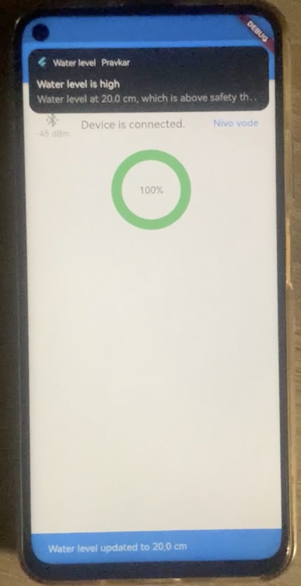

# Sistem za spremljanje nivoja vode 

## Ideja: 
Želel sem sistem, ki me opozori ko je gladina vode v kadi na želeni višini in grem lahko brez vmesnega pogledovanja mirno iz moje sobe v kopalnico. 

## Izvedba: 
Projekt uporablja ultrazvočni senzor za merjenje razdalje do predmetov, v tem primeru globine vode v kadi. Meritve so prikazane v realnem času na LCD zaslonu, ki je povezan z mikrokrmilnikom STM32. Dodatno projekt vključuje Bluetooth modul HM-10, ki omogoča brezžično pošiljanje meritev razdalje na aplikaciji narejeni v ogrodju Flutter na Android napravi. Z uporabo aplikacije na mobilni napravi lahko prejemam podatke o razdalji v realnem času, kar omogoča enostavno spremljanje in analizo meritev na daljavo. Ta funkcionalnost prinaša dodano vrednost v situacijah, kjer ni praktično ali možno nenehno spremljati LCD zaslona na mikrokrmilniku. 
V Flutter aplikaciji so uporabljene knjižnice: 
- <a href="https://pub.dev/packages/flutter_blue_plus">flutter_blue_plus</a>
Uporablja se za komunikacijo med bluetooth modulom in Flutterjem 

- <a href="https://pub.dev/packages/flutter_local_notifications">flutter_local_notifications </a>
Uporablja se za pošiljanje obvestil na mobilni napravi 

- <a href="https://pub.dev/packages/simple_circular_progress_bar">simple_circular_progress_bar </a>
Uporablja se za prikaz napolnjenosti kadi s "progress barom" 

## Komponente:  
 - STM32F3DISCOVERY razvojna plošča 
 - ultrazvočni senzor (HC-SR04) 
 - HM-10 BLE 4.0 Bluetooth module 
 - LCD zaslon - I2C 1602 LCD Display Module 16X2 
